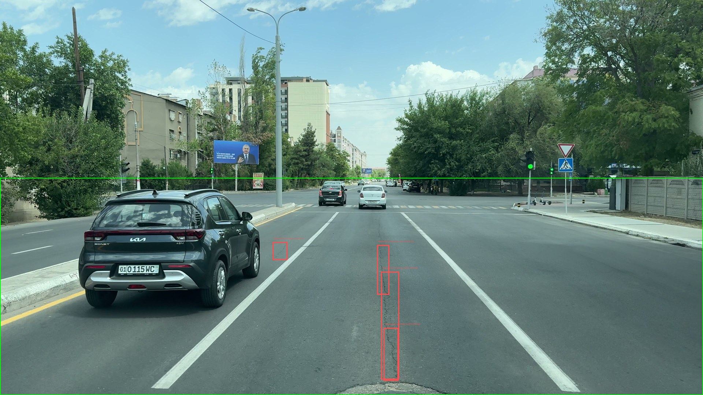

# Smart Road — automated Pavement Condition Index from road imagery

[](https://github.com/uzbtrust/smart-road/actions/workflows/ci.yml)

## Project partner

**[Raximjon Soataliyev](https://github.com/BeEngineer-UZ)** — road engineer, lecturer at Tashkent State Transport University
[LinkedIn](https://www.linkedin.com/in/raximjon-soataliyev-6b0b3b196/) · [ResearchGate](https://www.researchgate.net/profile/Raximjon-Soataliyev) · [GitHub](https://github.com/BeEngineer-UZ)

This project was his idea before it was anyone's code.

He brought the ASTM D6433 framing that the entire pipeline is built around — the
decision to *grade* a road against a standard rather than count defects, which is
the one thing that makes this different from every road-damage detector on
GitHub. He defined what had to be measured and to what tolerance. As the domain
expert he ruled on what counts as a distress, at what severity, and where the
engineering judgement sits that a model cannot supply.

He also carried out the field survey the whole system is validated against:
**1,810 m of Yangizamon street in Tashkent, 12 sections, 9 distress types,
measured by hand.** Without those measurements there is nothing here to check the
model against, and no way to know whether any of it is true.

And he backed it materially. There was no funding, no institution and no budget
behind this — he paid for the GPU time that trained the model, and stayed with it
from the first sketch through to the point where the system could be demonstrated
working.

**He did not assist this project. He is a partner in it.** The code is mine; the
problem, the standard, the measurements and the means to build it are his.

---

Most road-condition tools **count** defects. This one **grades** the road the way
an engineer is required to — through **ASTM D6433**, the standard that turns a
distress survey into a Pavement Condition Index between 0 and 100.

Four stages, end to end:

1. **Detect** — YOLO11-L over eight distress classes named and numbered to match
   ASTM D6433. mAP50 **0.657**, reproduced locally at 0.649.
2. **Measure** — inverse perspective mapping converts detections into square
   metres and metres *on the road plane*, not in pixels.
3. **Grade** — densities go through ASTM's deduct-value curves and the corrected
   deduct-value iteration. Validated against the worked example printed in the
   standard: it prints max CDV 51 / PCI 49, this gives **51.4 / 48.6**.
4. **Report** — PCI per frame or per road section, with the deduct breakdown that
   produced it.



*A 4K survey frame from Yangizamon street, Tashkent. Green: the surface
searched. Red: detections. The three stacked boxes are one crack, fragmented at
tile seams — flagged rather than silently merged.*

## Why the standard, and not a defect count

A count treats every defect as equal. ASTM does not, and the difference is not
academic. On the field survey this project was validated against, one section
had potholes at **0.7 %** density and another had block cracking at **35.2 %**.
Fifty times the density — and the *smaller* one produces four times the damage
(deduct 62.6 against 16.9), because ASTM's pothole curve is by far the steepest
of the set.

Rank those sections by defect count and the repair crew goes to the wrong
street. That gap is the whole reason for implementing the standard rather than
approximating it.

## Results

| Model | File | Test result |
|---|---|---|
| Distress detector (primary) | `yolo11l_640_best.pt` | mAP50 **0.657** · mAP50-95 0.401 · P 0.682 · R 0.604 |
| Higher-resolution variant | `yolo11m_1024_best.pt` | mAP50 0.544 · mAP50-95 0.316 |
| PCI engine | `smartroad/pci/` | ASTM D6433-07 worked example: 48.6 against a published 49 |

Trained on a rented RTX 5090 (32 GB), 143 epochs of a planned 150 — early
stopping at `patience=30`, best epoch 113, 17.8 hours. Weights:
[huggingface.co/uzbtrust/smart-road-pci-yolo11](https://huggingface.co/uzbtrust/smart-road-pci-yolo11).

Per class, on 3,550 validation images:

| # | Class | ASTM № | Train boxes | mAP50 | mAP50-95 |
|---|---|---|---:|---:|---:|
| 3 | patching | 11 | 7,719 | 0.783 | 0.564 |
| 7 | marking / manhole | — | 17,334 | 0.781 | 0.501 |
| 6 | lane / shoulder drop-off | 9 | 308 | 0.731 | 0.319 |
| 1 | alligator crack | 1 | 16,056 | 0.672 | 0.388 |
| 0 | longitudinal & transverse crack | 10 | 53,293 | 0.637 | 0.364 |
| 5 | weathering / raveling | 19 | 1,805 | 0.602 | 0.325 |
| 4 | pothole | 13 | 7,394 | 0.549 | 0.248 |
| 2 | block crack | 3 | **59** | 0.502 | 0.502 |

The whole run reproduces on Apple silicon (MPS, torch 2.13) at mAP50 0.649 —
1.2 % under the CUDA figure, per-class within 0.01.

## Install and run

Requires Python 3.12+.

```bash
git clone https://github.com/uzbtrust/smart-road.git
cd smart-road
python3 -m venv .venv && source .venv/bin/activate
pip install -r requirements.txt
python scripts/download_models.py   # fetches weights from Hugging Face
streamlit run app.py                # http://localhost:8501
```

`pytest tests -q` runs 168 tests; the PCI, geometry and tiling halves need
neither torch nor a GPU.

### The app

- **Sample / Upload** — five bundled frames (Tashkent 4K survey and Tehran
  street-level), or your own road photograph.
- **Tiled inference** toggle — the difference it makes is visible immediately on
  the 4K samples.
- **Camera panel** — height above the road, focal length and horizon row. The
  PCI moves as you change them, which is the point: those are the assumptions
  the measurement rests on.
- **Severity slider** — the model has no severity head, so a severity is applied
  to every detection. Sweeping it shows the range the answer really occupies.
  On the bundled Tehran frame: **50.3 → 35.2 → 19.4** for low → medium → high.

## What is actually hard here

**Unit conversion is not a detail.** ASTM's curves were drawn in inch-pound
units. Area density is dimensionless and passes through unchanged, but linear
density does not (× 0.3048) and neither does a pothole count (× 0.0929).
Skipping that conversion on one real survey section moved its PCI from 26.6 to
**0.0** — errors up to 26 points, silently.

**Camera height dominates the error budget.** Ground area per pixel goes as
`height² / (dy³·f²)`, so a 10 % error in the tape measurement becomes a 21 %
error in every density, and therefore in the deduct value. Asserted in
`tests/test_from_detections.py`, not just claimed.

**Severity is only measurable close to the camera.** On 1080p survey footage,
ASTM's low/medium threshold for crack width (10 mm) is about 4 px at 3.5 m and
under 2 px at 9 m. Cracks stay *visible* far past the point where they stay
*measurable*.

**A 4K frame cannot be fed to a 640 px model.** That is a 6× downscale: a crack
four pixels wide in training falls below one pixel and disappears. On our own
survey frames, whole-frame inference returned 0 and 2 detections where tiled
inference returned 2 and 4. `smartroad/detect/tiled.py` tiles the road region
with 20 % overlap, merges per class, and flags any box touching a tile seam —
a crack split across two tiles is two fragments, and for a length measurement
that distinction changes the answer.

**A bounding box is not the distress.** The box is axis-aligned; the ground
patch it covers is a trapezoid. Over 5–8 m that over-reports area by about 30 %,
which `tests/test_from_detections.py` derives analytically and asserts, rather
than leaving it as a surprise in the field.

## Validating against a real engineering survey

A civil engineer surveyed 1,810 m of Yangizamon street in Tashkent by hand: 12
sections, 9 distress types, L/M/H severity. His paper states plainly that a PCI
was never calculated, because the deduct-value curves were not applied. He used
a simpler cumulative metric instead, and noted himself that it has "no
calibrated scale, deduct-value weighting, or condition rating comparable to
standardized PCI."

Running his densities through the ASTM curves produces the 12 values he stopped
short of:

| | S1 | S2 | S3 | S4 | S5 | S6 | S7 | S8 | S9 | S10 | S11 | S12 |
|---|---|---|---|---|---|---|---|---|---|---|---|---|
| **PCI** | 52.3 | 64.6 | 61.1 | 33.1 | 64.8 | 62.7 | **26.6** | 32.4 | 45.6 | 58.3 | 45.6 | 69.9 |

Whole street **51.4 (Poor)**; direction A 56.4, direction B 46.4. Six corrupted
cells in the survey spreadsheet were found and reconciled against the published
figures in the process. Full working:
[`DATA/docs/YANGIZAMON_PCI.md`](DATA/docs/YANGIZAMON_PCI.md).

## Layout

```
app.py                     Streamlit interface
smartroad/
  pci/
    engine.py              deduct values, CDV iteration, PCI, ASTM rating scale
    curves.py              digitised deduct curves (generated -- see tools/)
    astm.py                distress catalogue, units, imperial conversion
    from_survey.py         reads a manual field survey out of a spreadsheet
    from_detections.py     detections -> densities -> PCI
  geometry/ipm.py          inverse perspective mapping
  detect/tiled.py          tiled inference with seam-aware merging
  data/build_yolo.py       merges four source datasets into one 8-class set
  report/                  self-contained HTML training report, inline SVG
tools/
  gen_curves.py            regenerates curves.py from the upstream MIT source
  kaggle_fetch.py          resumable dataset download
scripts/download_models.py
tests/                     168 tests
```

## Dataset

Four public road-damage datasets merged into a single ASTM taxonomy: **40,994
training and 3,550 validation images, 113,648 boxes**.

| Source | Images |
|---|---:|
| RDD2022 | 26,661 |
| RDD2018 (Japan) — train split only | 9,052 |
| SVRDD (street view) | 8,000 |
| Attain (Tehran) | 840 |

Not in this repo (≈4.7 GB) — published as
[`uzbtrust/smartroad-yolo`](https://www.kaggle.com/datasets/uzbtrust/smartroad-yolo)
on Kaggle. `smartroad/data/build_yolo.py` rebuilds it from the source datasets;
`tools/kaggle_fetch.py` downloads the built version with resume support.

Sources are CC BY-SA 4.0 and the merged set carries the same licence.

## Retraining

```bash
python vast/train.py --model yolo11l.pt --imgsz 640 --batch 32
```

Full hyperparameters are recorded in `runs_archive/yolo11l_640/args.yaml`, along
with the training curves, confusion matrices and per-epoch metrics of both runs.

Two things worth knowing before repeating it. `patience=30` was too tight — the
best epoch was 113, so the curve was still improving past 100. And
`close_mosaic` did not deliver its usual late boost: mAP50 went 0.655 → 0.653
when mosaic switched off while `cls_loss` fell from 0.929 to 0.678, which is the
model fitting the training distribution harder without generalising better.

## Limitations

- **Block cracking has 59 training boxes and 2 in validation.** Its metrics are
  noise. The same goes for lane/shoulder drop-off (4 validation images).
- **Pothole is the weakest well-populated class**, and the costliest to be weak
  at, since its deduct curve is the steepest.
- **The checkpoint declares ten classes.** It was trained against a `data.yaml`
  carrying two extra entries with zero examples. Indices 0–7 are correct and
  unshifted, but heads 8 and 9 are untrained — pass `classes=range(8)`.
- **A frame is not a sample unit.** ASTM's asphalt sample unit is 232 ± 93 m²;
  one frame typically covers less. Aggregating frames into sample units needs
  frame-to-frame deduplication, which is not implemented here.

## Licence

Code MIT ([LICENSE](LICENSE)). Weights AGPL-3.0, inherited from Ultralytics
YOLO11. Deduct-value coefficients digitised from
[brandnewbox/pavement_condition_index](https://github.com/brandnewbox/pavement_condition_index)
(MIT); `tools/gen_curves.py` regenerates them from that source.
